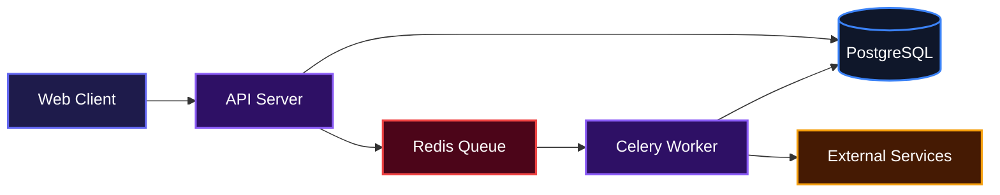
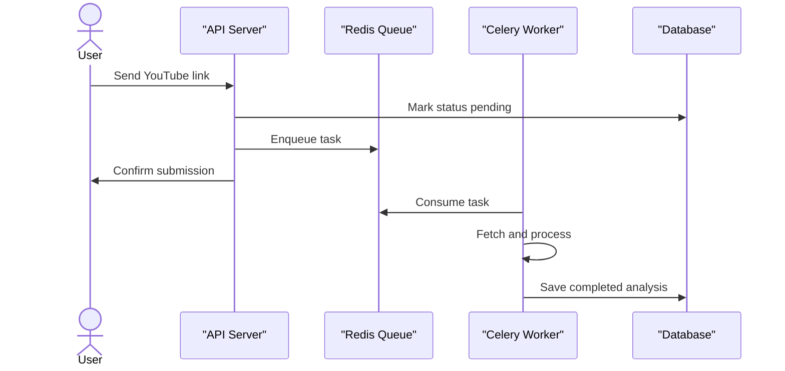
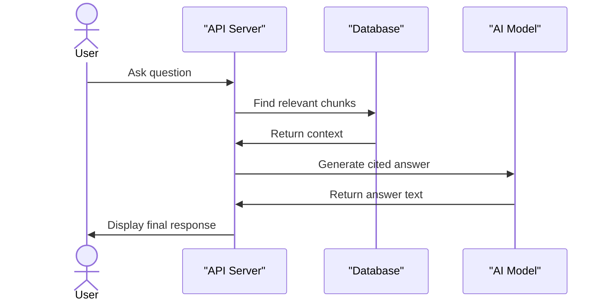

# Logos

A backend service for turning YouTube sermons into a searchable, personal knowledge base.

## Overview

Logos helps individuals capture and organize insights from audio messages without having to take manual notes. It takes a video input, processes the transcript to extract key teachings, and allows users to query their entire listening history using natural language. This removes the friction of revisiting past lessons and makes personal study highly accessible without requiring complicated setup.

## System Architecture



## Features

* **Automated Sermon Analysis**: Automatically generates summaries, key teachings, and themes from a simple YouTube link.



* **Contextual Q&A (RAG)**: Ask questions spanning multiple sermons and receive cited answers directly from the transcript content.



* **Semantic Search**: Find specific moments across an entire library using meaning rather than exact keywords.
* **Personalized Notes**: Attach personal reflections to specific sermons alongside the generated AI analysis.

## Installation

Clone the Repository:

```bash
git clone https://github.com/DanielPopoola/logos.git
cd logos
```

Set up your local environment and dependencies using `uv`. You will also need Docker to run the database and cache.

```bash
uv sync --all-extras --dev
docker compose up -d
cp .env.example .env
```

Make sure to populate your `.env` file with your real LLM API keys and Google Client credentials.

Run the database migrations and install your pre-commit hooks.

```bash
uv run alembic upgrade head
uv run pre-commit install
```

## Usage

Once the infrastructure is up, start the FastAPI server and the Celery worker in separate terminals.

To start the API server:
```bash
uv run uvicorn app.main:app --reload
```

To start the background worker:
```bash
uv run celery -A app.workers.celery_app worker --loglevel=info
```

To submit a new sermon for processing, make a standard HTTP POST request.
```bash
curl -X POST http://localhost:8000/v1/sermons \
  -H "Content-Type: application/json" \
  -H "Cookie: session_token=YOUR_SESSION_TOKEN" \
  -d '{"youtube_url": "https://youtube.com/watch?v=ABC123"}'
```

If you prefer testing the pipeline directly without hitting the API endpoints, you can use the verification script provided.
```bash
uv run python scripts/verify_ingestion.py "https://www.youtube.com/watch?v=VIDEO_ID"
```

## Technologies Used

| Technology | Purpose |
|------------|----------|
| **FastAPI** | High-performance Python web framework for building the REST API. |
| **PostgreSQL & pgvector** | Primary data storage and vector search engine for embeddings. |
| **SQLAlchemy & Alembic** | ORM for database interactions and migration management. |
| **Celery & Redis** | Task queue and broker for managing asynchronous video ingestion. |
| **Gemini LLM** | Powers transcript analysis, summaries, and query embeddings. |
| **pytest & uv** | Testing framework and fast Python package management. |

## Author Info

* Name: Daniel Popoola
* Email: iamuchihadaniel236@gmail.com
* GitHub: https://github.com/DanielPopoola

## Badges

[](https://www.python.org/)
[](https://fastapi.tiangolo.com/)
[](https://www.postgresql.org/)
[](https://docs.celeryq.dev/)
[](https://redis.io/)

[](https://dokugen.samueltuoyo.com)